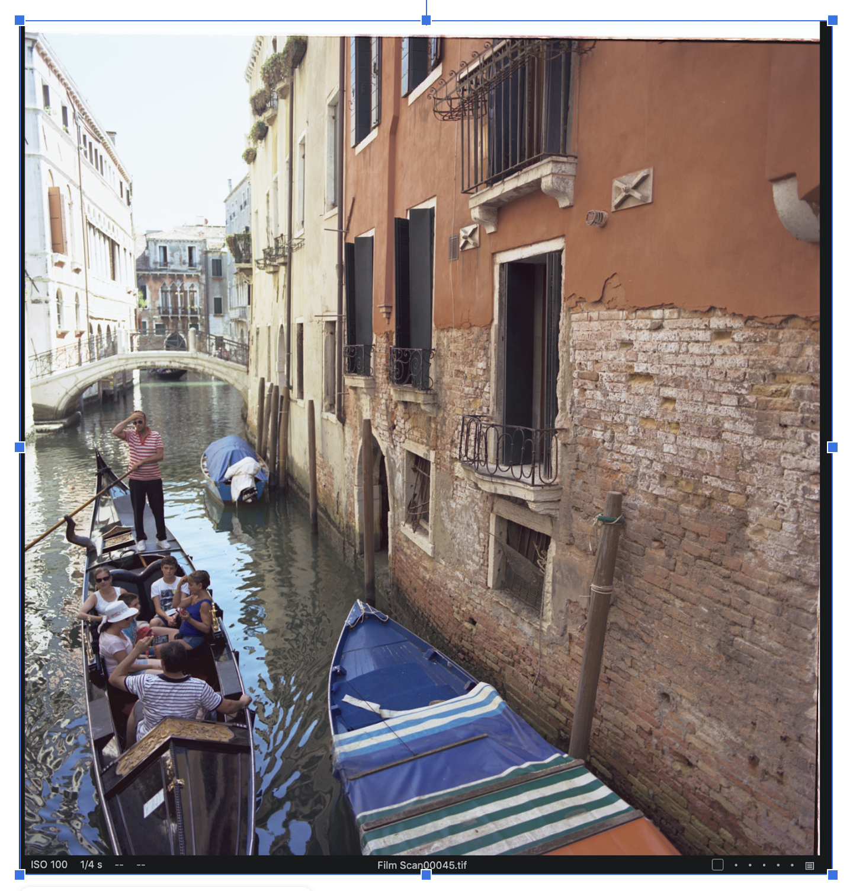
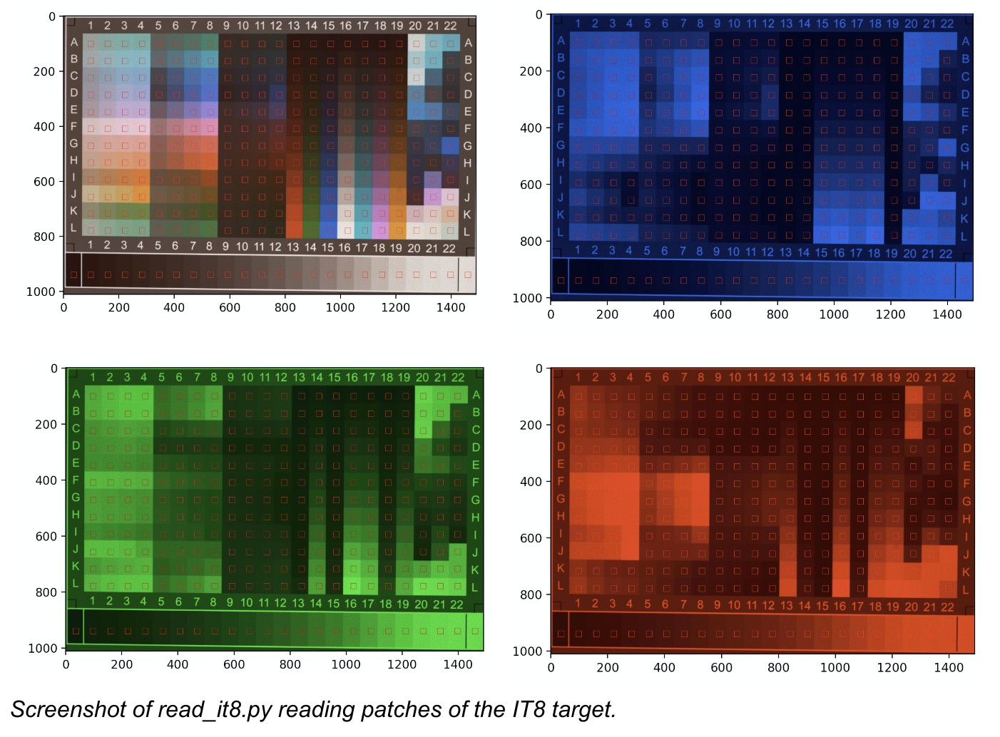
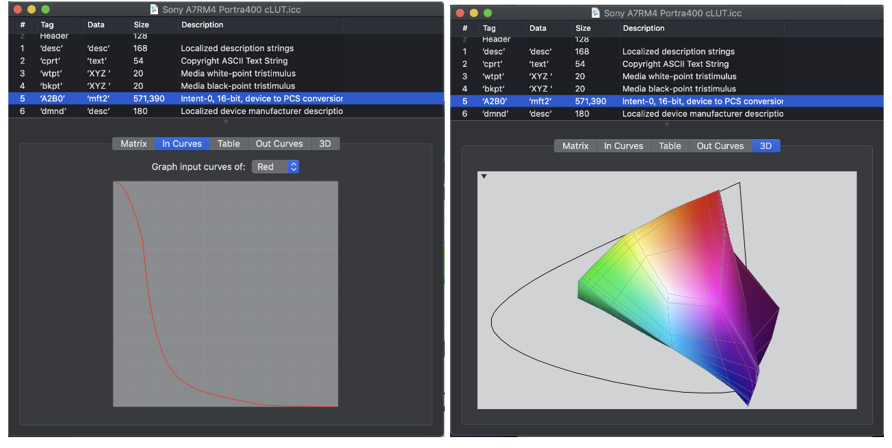
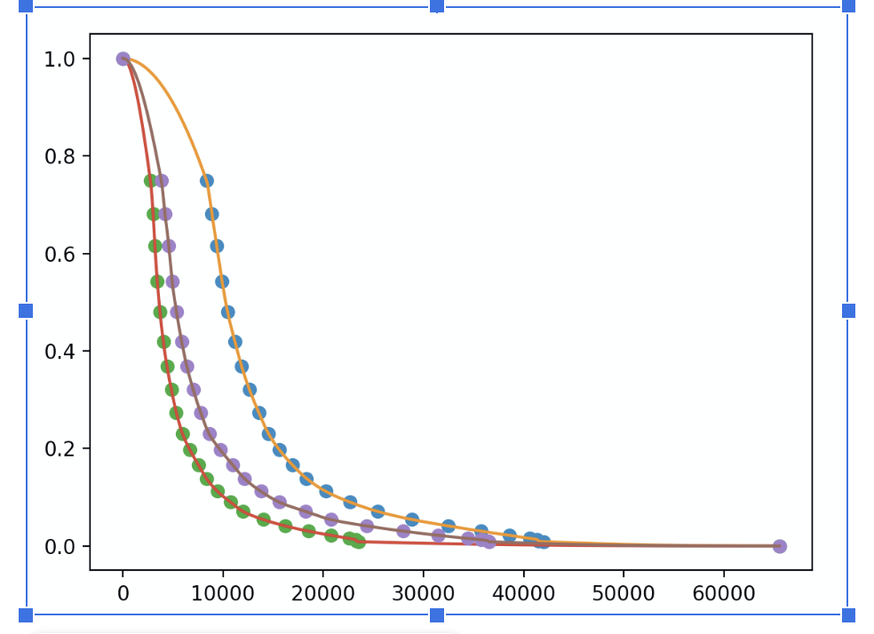

# Objective

NegICC is a project for creating ICC profiles for color negatives. The main
objective of the tool is to have consistent colors for images of negative
film taken with a digital camera.

The ICC profiles created should have the following properties:
* Allow color balance adjustments
* Produces netural color which allows further adjustments
* Can be used with commonly available photo editting tools



# Introduction

An ICC profile alone is insufficient to gurantee consistency from frame to
frame. You need good color separation from the captured images in the
physical department. I created a [guide](https://docs.google.com/document/d/1NsfFPx5c7kxNRUhuGQBKRNnaN0c52SjLsZsyhLCj3OE/edit?usp=sharing) with detailed steps. An older [document](https://docs.google.com/document/d/1OrmYLJbnluGod663s_0ZrWyX9wF_R-uxLu4libq2c2U/edit#heading=h.g6xkp75rwj2t) has more details of the
research I have done.

After good color separation is archived we can apply an ICC profile to the
captured linear images to map to a well known color space. In the case of
ICC it is CIE XYZ chromatically adapted to D50 illuminant. This allows the
image with this profile to be mapped to other color space for further
editting.



The profiles created by NegICC is not meant to be a color space and not
suitable for general editing. They are used for correcting the curves of
the color channels and to map to the CIE XYZ.

There are three profiles generated by NegICC:
* Curve + cLUT ICC V2 Profile
* Curve + Matrix ICC V4 Profile
* Matrix + Curve + cLUT V4 Profile





The purpose of the curve is to turn a negative image into a 'positive' one
with RGB values linear to the original luminance values. The way to
accomplish this is by correcting for the gray scale patches on a reflective
IT8 target. Using the digital camera setup described in the document above
we can estimate that the R channel should have gamma of -2 and G channel
should have gamma of -1.33 and B channel of gamma -1.42 for example. These
values are greatly dependent on the film, light, camera and filter
combination.

The cLUT or matrix is to map the resultant linerized RGB values into XYZ
values. cLUT usually is more accurate but could cause clipping and hence
not ideal for photo editting. Matrix is much less accurate but is more
robust for editting.

The matrix in the third profile includes a crosstalk correction matrix to
account for crosstalk between RGB channels of the digital sensor, the
curves and the cLUT. The matrix is an invariant of CFA sensor and triband
filter (optional with tricolor light source). However this V4 profile uses
a MPET pipeline that is not compatible with many image editors and is there
for completeness only.

The process of using the profiles should be:
1. Use a RAW developer (e.g. neg_process included or dcraw) to output a
   linear image.
2. Apply crosstalk correction matrix computed. Use neg_process can do this
   in step (1) or use ImageMagick separately.
3. Add (but not convert using) the cLUT or matric ICC profile to image from step 2.

Included in this repo is data files from Ektar100 film exposed with a
IT8 target under 5400K sunlight and scanned using a Sony A7RM4 digital camera
with a Edmund Optics #87-254 triband filter. The crosstalk correction matrix
is estimated by additionally scanning with red, blue and green bandpass filters.

The IT8 target is measured using a Konica Minolta CS100A spot colorimeter and
the readings are also included in this repo.

The RGB curves are estimated using a Pchip spline curve interpolation. And the
resultant crosstalk corrected and 'positive' values are then fed into ArgyllCMS
to compute the cLUT and color matrix. The avg error is about 0.87 and 7.2 (over
100) respectively.

# Requirements

* Python 3
* ArgyllCMS
* OpenCV
* Numpy
* Scipy
* scikit-learn
* lcms2
* libRAW
* colour-science 0.4.1

# Hardware Used

## Creating Profiles
* IT8 target (R190808 from coloraid.de)
* Edmund Optics #87-254
* Bandpass filters: MidOpt BP470, BP525 and LP610

## Capturing (previous setup)
* Fiet 74204/CA led light panel
* Edmund Optics #87-254
* Nikon Z7
* Rayfact QVM05041MF

## Capturing (new setup with 4-shot pixel shift)
* Olafus 25W RGB Flood Light
* Edmund Optics #87-254
* Sony A7RM4
* Rayfact QVM05041MF

# Usage

All the steps are programmed in the Makefile. Running make will build the 
ICC profiles. This will generate a ./neg_invert.sh script that can be used
to produce a TIFF image that embeds the cLUT profile.

The cLUT applied TIFF image can be editted with Capture One. The suggested
workflow is to adjust *only* the levels using the Levels tool. This mimic
adjusting the color filtration in making darkroom prints assuming we already
have good color separation. You can also do exposure adjustments as well.
After the image is color balanced, it should be exported to AdobeRGB and
imported again for further editting.

Note that the profile is only good for the particular setup I used. You will
need to develop your own IT8 target exposures, scan them with filters and run
this again. The steps for generating the data files are in the Makefile.

```
# Make neg_process tool for RAW developing.
make neg_process

# Make profile for Sony A7RM4 with Portra 400
make sony_a7rm4_portra400_0

# Make profile for Sony A7RM4 with Portra 400 +2 stops exposure
make sony_a7rm4_portra400+2
```

# More details

Please see the code in build_prof.py and make_icc.c for more algorithms and
details.
