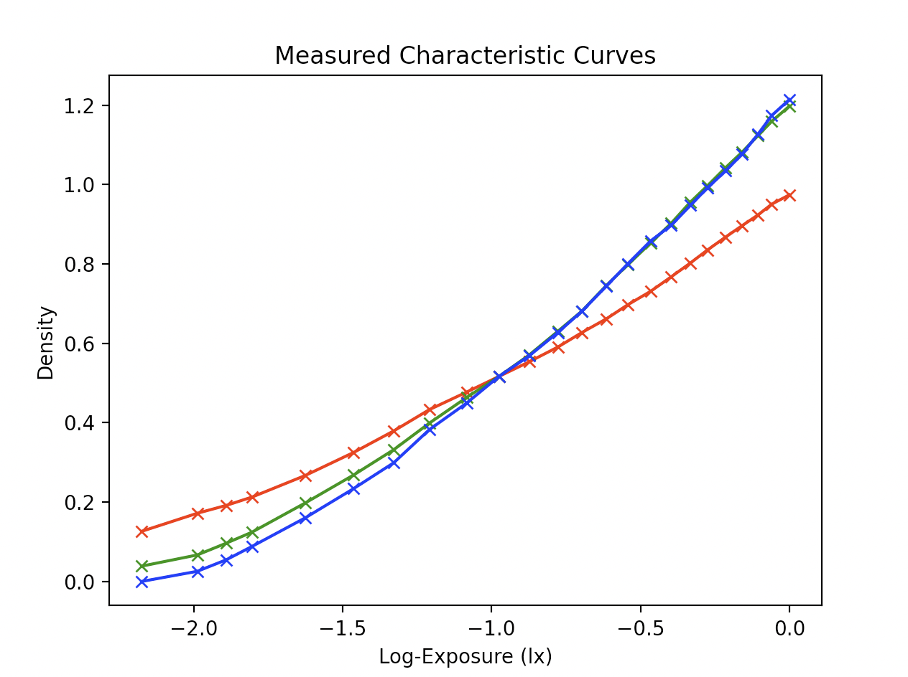
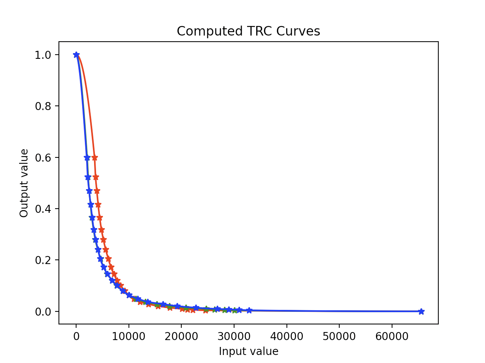

# Objective

NegICC is a project for creating ICC profiles for color negatives. The main
objective of the tool is to have consistent colors for images of negative
film taken with a digital camera.

The ICC profiles created should have the following properties:
* Allow color balance adjustments
* Produces netural color which allows further asdjustments
* Can be used with commonly available photo editting tools


# Introduction

Typical color negative conversion software operates in sRGB colorspace.
However color negative is a medium for recording color information in terms
of dye density. The density of the dyes is designed to be extracted with
[Status M](https://law.resource.org/pub/us/cfr/ibr/001/aimm.it2.18.1996.pdf) densitometry and is not under D50 or 5000K light.

The first step of scanning film with a digital camera is to produce response
that resembles Status M densitometry with good sepearation between the channels.
I created a [guide](https://docs.google.com/document/d/1NsfFPx5c7kxNRUhuGQBKRNnaN0c52SjLsZsyhLCj3OE/edit?usp=sharing) with detailed steps.

# How does it work?

With a triband filter (or narrowband LED light) and crosstalk
correction, the RGB response is still not linear to density. From this diagram
B and G response of the profiled film are closest resemblance, but R response
has a different slope.



A IT8 reflective target recored on film is used to correct the different
responses and to invert into linear RGB that corresponds to the original
luminance values.


The tool provided in this repo will generate the following curves.



Last step is to convert to the CIE XYZ colorspace using either a 3D-LUT or Matrix.
These two steps can be encoded as a ICC profie.

The profiles created by NegICC is not meant to be a colorspace and not
suitable for general editing. They are used for correcting the curves of
the color channels and to map to the CIE XYZ.


# ICC Profile Description

There are three profiles generated by NegICC:
* Curve + cLUT ICC V2 Profile
* Curve + Matrix ICC V4 Profile
* Matrix + Curve + cLUT V4 Profile

The cLUT or matrix is to map the resultant linerized RGB values into XYZ
values. cLUT usually is more accurate but could cause clipping and hence
not ideal for photo editting. Matrix is much less accurate but is more
robust for editting.

The matrix in the third profile includes a crosstalk correction matrix to
account for crosstalk between RGB channels of the digital sensor, the
curves and the cLUT. The matrix is an invariant of CFA sensor and triband
filter (optional with tricolor light source). However this V4 profile uses
a MPET pipeline that is not compatible with many image editors and is there
for completeness only.

Included in this repo is data files from films exposed with a
IT8 target under 5400K sunlight and scanned using a Sony A7RM4 digital camera
with a Edmund Optics #87-254 triband filter. The crosstalk correction matrix
is estimated by additionally scanning with red, blue and green bandpass filters.

The IT8 target is measured using a Konica Minolta CS100A spot colorimeter or
downloaded from coloraid.de. The readings are also included in this repo.

The RGB curves are estimated using a Pchip spline curve interpolation. And the
resultant crosstalk corrected and 'positive' values are then fed into ArgyllCMS
to compute the cLUT and color matrix. The avg error is about 0.87 and 7.2 (over
100) respectively.

# Requirements

* Python 3
* PIP
* ArgyllCMS
* libRAW
* lcms2
* Clang
* Matplotlib
```
sudo apt-get install python3 pip argyll liblcms2-dev libraw-dev
```
* Python packages
```
pip install opencv-python matplotlib colour-science pandas scikit-learn scipy
```

# Hardware Used

## Creating Profiles
* IT8 target (R190808 from coloraid.de)
* Edmund Optics #87-254
* Bandpass filters: MidOpt BP470, BP525 and LP610

## Capturing (previous setup)
* Fiet 74204/CA led light panel
* Edmund Optics #87-254
* Nikon Z7
* Rayfact QVM05041MF

## Capturing (new setup with 4-shot pixel shift)
* Olafus 25W RGB Flood Light
* Edmund Optics #87-254
* Sony A7RM4
* Rayfact QVM05041MF

# Usage Example

Run the following commands to use RAW develop tools and ICC profiles.

```
# Make neg_process tool for RAW developing.
make neg_process

# Make profile for Sony A7RM4 with Portra 400
make sony_a7rm4_portra400_0

# Make profile for Sony A7RM4 with Portra 400 +2 stops exposure
make sony_a7rm4_portra400+2
```

neg_process tool uses LibRAW to unpack raw files. It can run in two modes,
4-shot pixel shift mode and single shot mode. The 4-shot pixel shift mode
assumes taken with Sony camera with such capability and will not for other
brands. In 4-shot pixel shift mode, the raw values are simply scaled by 4
to convert from 14-bit raw to 16-bit image after subtracting the dark value.
In single shot mode, libRAW processing is used and scales automatically but
without auto brightness. Either mode will give consistent results as long
as you don't switch between the two modes.

Usage like this:
```
# Single shot mode. The output format is PPM.
bin_out/neg_process -o output_file.ppm input.raw

# 4-shot pixel shfit mode. The output format is TIFF without a ICC profile.
# If 4 input files are provided, it assumes 4-shot PS mode.
bin_out/neg_process -o out.tif -p some_profile.icc input1.raw input2.raw input3.raw input4.raw
```

Note that the profile is only good for the particular setup I used. You will
need to develop your own IT8 target exposures, scan them with filters and run
this again. The steps for generating the data files are in the Makefile.

The cLUT applied TIFF image can be editted with Capture One. The suggested
workflow is to adjust *only* the levels using the Levels tool. This mimic
adjusting the color filtration in making darkroom prints assuming we already
have good color separation. You can also do exposure adjustments as well.
After the image is color balanced, it should be exported to AdobeRGB and
imported again for further editting.

# More details

Please see the code in build_prof.py and neg_process.{cc, py} for details of the algorithm.
